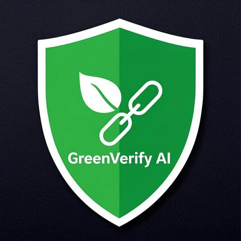
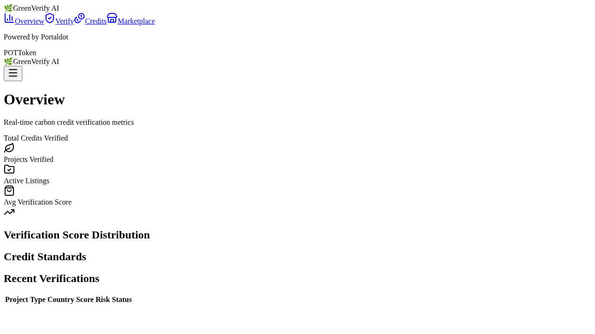
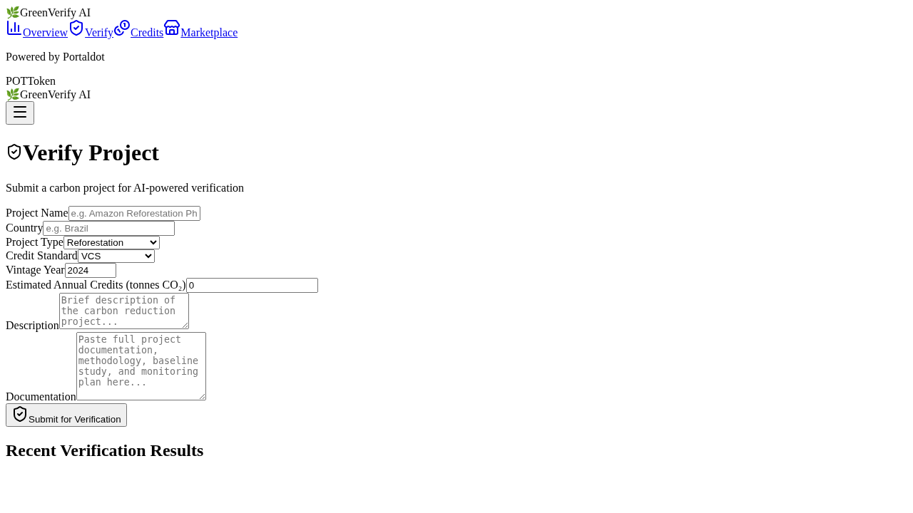
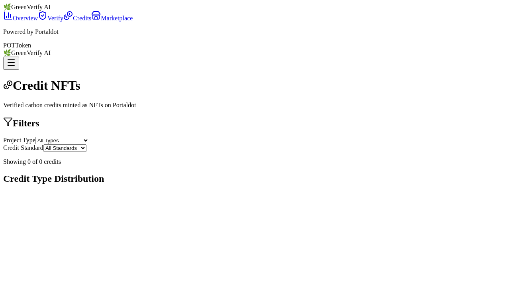
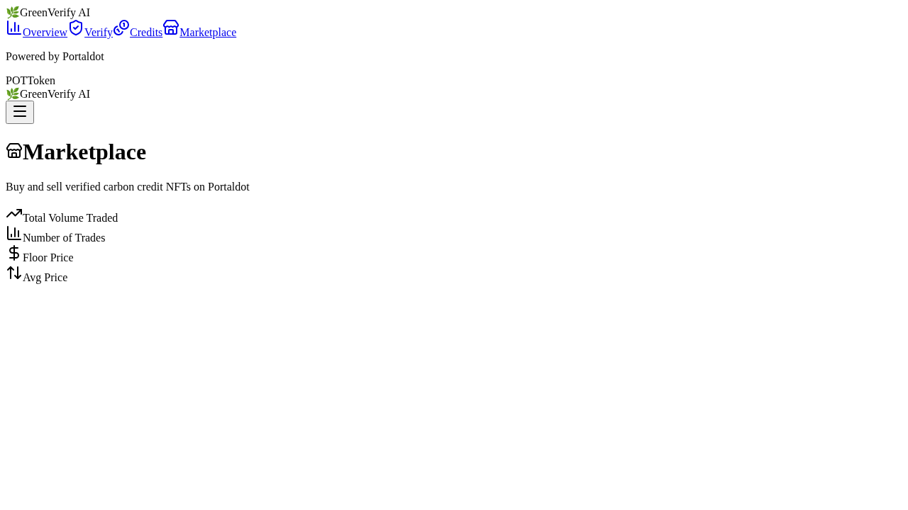

<p align="center"></p>

<h1 align="center">GreenVerify AI</h1>

<p align="center">
  <strong>AI-Powered Carbon Credit Verification & Trading on Portaldot</strong>
</p>

<p align="center">
  
  
  
  
  
  
</p>

---

## Dashboard Screenshots

<p align="center">
  
  
  
  
</p>

---

## Overview

GreenVerify AI is an end-to-end platform that combines **artificial intelligence** with **blockchain technology** to transform how carbon credits are verified, tokenized, and traded. Built for the DoraHacks Portaldot S1 Hackathon, it demonstrates a fully functional AI-powered onchain workflow on the Portaldot (Substrate-based) network.

### Why This Matters

The global voluntary carbon market is projected to reach **$2 billion by 2030**, yet it faces critical challenges that undermine trust and scalability:

- **Slow & expensive verification** — Traditional third-party audits take 6–18 months and cost $15,000–$50,000+ per project, creating a bottleneck that keeps high-quality credits off the market.
- **Trust deficit** — Concerns about "ghost credits" and double-counting have eroded buyer confidence, with studies suggesting 10–30% of registry credits may represent limited real-world emission reductions.
- **Fragmented liquidity** — Credits are siloed across dozens of registries with no unified trading infrastructure, making price discovery difficult and transaction costs high.

### Our Solution

GreenVerify AI addresses these problems at every step of the carbon credit lifecycle:

1. **AI-Powered Verification** — Uses Alibaba's **Qwen LLM** (via DashScope) to perform rapid, rigorous carbon credit project assessments. The AI evaluates additionality, permanence, measurability, leakage risk, methodology compliance, and documentation quality, producing a structured 0–100 verification score with detailed risk assessment and actionable recommendations — in seconds instead of months.

2. **Onchain Tokenization** — Verified carbon credits are minted as **PSP34 NFTs** (ink!'s ERC-721 equivalent) on Portaldot, with rich on-chain metadata capturing project details, verification history, vintage year, and credit standard compliance. Every credit is unique, traceable, and tamper-proof.

3. **Decentralized Marketplace** — An escrow-based onchain marketplace enables trustless trading of carbon credit NFTs in **POT** (Portaldot's native token). The smart contract handles listing, purchase, and settlement automatically — no intermediaries required.

4. **Dual-Region AI Infrastructure** — The Qwen LLM client operates with a China-primary / Singapore-fallback architecture through DashScope, ensuring high availability and low-latency AI inference across Asia-Pacific markets.

The platform ships with **22 pre-loaded carbon credit projects** spanning reforestation, renewable energy, methane capture, and industrial efficiency across 21 countries, providing a realistic demonstration environment with 5 verified projects, 5 minted credit NFTs, and 3 active marketplace listings.

---

## Key Features

- **AI-Powered Verification** — Qwen LLM (qwen-plus) analyzes project documentation against 7 verification criteria (additionality, permanence, measurability, leakage, methodology, documentation quality, compliance) and returns a structured 0–100 score, risk classification (Low/Medium/High/Critical), detailed narrative assessment, and 3–7 actionable recommendations.

- **Onchain Carbon Credits** — PSP34 NFT standard on Portaldot with rich metadata (project name, verifier identity, vintage year, credit standard, country, project type). Supports mint, transfer, and retirement (burn) operations with domain-specific events.

- **Decentralized Marketplace** — Escrow-based listing and purchase flow in POT tokens. Cross-contract PSP34 calls handle NFT custody. Supports listing, delisting, and buying with full event emission.

- **22 Pre-loaded Carbon Projects** — Reforestation (Amazon, Congo Basin, Vietnam, Canada, Colombia, Indonesia), Renewable Energy (India, China, Morocco, Chile, South Korea, Bangladesh, Ethiopia, Kenya), Methane Capture (USA, India, Australia, Nigeria), and Industrial (Germany, Japan, Tanzania, Poland) across 21 countries.

- **Real-time Dashboard** — 4 interactive views: Platform Overview (metrics, charts, recent activity), AI Verification (submit & review assessments), Carbon Credits (NFT portfolio), and Marketplace (list, browse, buy).

- **Dual-Region AI** — China (dashscope.aliyuncs.com) primary endpoint with Singapore (dashscope-intl.aliyuncs.com) automatic fallback and 3x retry per endpoint.

---

## Architecture

```
┌──────────────────────────────────────────────────────────────────────────┐
│                        GreenVerify AI Platform                          │
│                                                                          │
│  ┌────────────────┐    ┌──────────────────────────────────────────┐     │
│  │   Dashboard     │    │           FastAPI Backend               │     │
│  │   (Next.js 16)  │    │                                          │     │
│  │                 │    │  ┌──────────────┐  ┌──────────────────┐  │     │
│  │  - Overview     │◄──►│  │ Verification  │  │  Market Data     │  │     │
│  │  - AI Verify    │    │  │   Engine      │  │   Service        │  │     │
│  │  - Credits      │    │  └──────┬───────┘  └──────────────────┘  │     │
│  │  - Marketplace  │    │         │                                │     │
│  └────────────────┘    └─────────┼────────────────────────────────┘     │
│                                 │                                       │
│                    ┌────────────┴────────────┐                          │
│                    │                         │                          │
│              ┌─────▼─────┐          ┌────────▼────────┐                 │
│              │ Qwen LLM  │          │   Portaldot     │                 │
│              │ (DashScope│          │   Blockchain    │                 │
│              │  China +  │          │                 │                 │
│              │Singapore) │          │  ┌───────────┐  │                 │
│              └───────────┘          │  │  ink! v5  │  │                 │
│                                     │  │ Contracts │  │                 │
│                                     │  │           │  │                 │
│                                     │  │ carbon-   │  │                 │
│                                     │  │ credit    │  │                 │
│                                     │  │ (PSP34)   │  │                 │
│                                     │  │           │  │                 │
│                                     │  │ market-   │  │                 │
│                                     │  │ place     │  │                 │
│                                     │  │           │  │                 │
│                                     │  │ verifier- │  │                 │
│                                     │  │ registry  │  │                 │
│                                     │  └───────────┘  │                 │
│                                     └─────────────────┘                 │
└──────────────────────────────────────────────────────────────────────────┘
```

---

## Tech Stack

| Layer | Technology | Purpose |
|-------|-----------|---------|
| **Blockchain** | Portaldot / Substrate | L1 for carbon credit NFTs and marketplace |
| **Smart Contracts** | Rust / ink! v5 / OpenBrush v3.1 | PSP34 NFT, marketplace, verifier registry |
| **AI Backend** | Python 3.11+ / FastAPI / Pydantic v2 | REST API, data models, business logic |
| **LLM** | Qwen-plus (DashScope) | Carbon credit verification analysis |
| **Frontend** | Next.js 16 / React 19 / Tailwind CSS 4 | Dashboard SPA and landing page |
| **Charts** | Recharts 3 | Interactive data visualizations |
| **Testing** | pytest + pytest-asyncio | API integration tests |
| **Linting** | Ruff | Python code formatting and linting |

---

## Smart Contracts

### `carbon-credit` — PSP34 NFT

The core carbon credit contract. Each token represents verified CO₂ offsets with full project metadata stored on-chain.

- **Standard**: PSP34 (ERC-721 equivalent) with OpenBrush Enumerable extension
- **Token ID**: Monotonic `u128` starting at 1
- **Metadata**: Project name, verification date, verifier account, vintage year, credit standard (VCS/GS/CDM/GoldStandard), country, project type
- **Operations**: `mint` (owner only), `burn` (retirement — any holder), `transfer_credit` (PSP34 transfer + custom event)
- **Indexing**: Blake2x256 hash on project name for efficient "all credits in project" queries
- **Events**: `CreditMinted`, `CreditTransferred`, `CreditRetired`

### `marketplace` — Escrow-based Trading

A decentralized marketplace for trading carbon credit NFTs in POT (Portaldot native token).

- **Listing**: Seller approves marketplace → calls `list(token_id, price)` → NFT pulled into escrow via cross-contract PSP34 transfer
- **Purchase**: Buyer calls `buy(token_id)` with exact POT value → POT forwarded to seller → NFT pushed to buyer
- **Delisting**: Seller calls `delist(token_id)` → NFT returned
- **Events**: `Listed`, `Sold`, `Delisted`

### `verifier-registry` — AI Verifier Management

On-chain registry of authorized AI verification agents.

- **Registration**: Owner-only `register_verifier(account, name, api_endpoint)`
- **Status management**: `update_verifier_status(account, active)` for suspension without deletion
- **Queries**: `is_verifier(account)`, `get_verifier(account)`, `get_all_verifiers()`
- **Events**: `VerifierRegistered`, `VerifierRemoved`, `VerifierStatusChanged`

---

## Quick Start

```bash
git clone https://github.com/Cubiczan/Stellar-critical-metal-traceability.git
cd Stellar-critical-metal-traceability/greenverify-ai

# Python backend
python -m venv .venv && source .venv/bin/activate
pip install -e ".[dev]"
PYTHONPATH=src python -m greenverify.api.main

# Dashboard (http://localhost:3001)
cd dashboard && npm install && npm run dev

# Landing page (http://localhost:3002)
cd landing && npm install && npm run dev
```

Set `DASHSCOPE_API_KEY` environment variable to enable AI verification.

---

## API Endpoints

| Method | Endpoint | Description |
|--------|----------|-------------|
| `GET` | `/api/health` | Health check and LLM connectivity test |
| `GET` | `/api/dashboard` | Platform dashboard overview metrics |
| `GET` | `/api/projects` | List all carbon credit projects |
| `GET` | `/api/projects/{project_id}` | Get a specific carbon credit project |
| `POST` | `/api/verify` | Submit a project for AI verification |
| `GET` | `/api/credits` | List all minted credit NFTs |
| `GET` | `/api/credits/{token_id}` | Get a specific credit NFT |
| `GET` | `/api/marketplace` | List all marketplace listings |
| `GET` | `/api/marketplace/{listing_id}` | Get a specific marketplace listing |
| `POST` | `/api/marketplace/list` | Create a new marketplace listing |
| `POST` | `/api/marketplace/buy` | Purchase a marketplace listing |

Interactive API documentation available at `/docs` (Swagger) and `/redoc` when the server is running.

---

## Dashboard Views

### 1. Platform Overview

The central hub showing platform-wide metrics: total verified credits, total traded credits, number of registered projects, active marketplace listings, and average verification score. Includes trend charts and recent verification activity feed.


### 2. AI Verification

Submit carbon credit projects for AI-powered verification. Enter project details and paste documentation text, then receive a comprehensive assessment including a 0–100 score, risk classification, detailed narrative, and actionable improvement recommendations.


### 3. Carbon Credits

Browse the portfolio of minted carbon credit NFTs. Each credit displays its token ID, project name, vintage year, credit standard, country, amount (tonnes CO₂e), and on-chain transaction hash.


### 4. Marketplace

Decentralized marketplace for trading verified carbon credits. Browse active listings with prices in POT, or create new listings from your credit NFT portfolio.


---

## Tracked Carbon Standards

GreenVerify AI recognizes and tracks credits from the following verification standards:

| Standard | Description |
|----------|-------------|
| **VCS** | Verified Carbon Standard (Verra) — the world's most widely used voluntary carbon standard |
| **Gold Standard** | Gold Standard for the Global Goals — premium standard with sustainable development requirements |
| **CDM** | Clean Development Mechanism (UNFCCC) — compliance market credits from developing countries |

---

## Project Structure

```
greenverify-ai/
├── logo_480.png                      # Project logo (480x480)
├── README.md                         # This file
├── Cargo.toml                        # Rust workspace (ink! contracts)
├── pyproject.toml                    # Python project config
│
├── src/
│   └── greenverify/
│       ├── __init__.py
│       ├── api/
│       │   ├── __init__.py
│       │   ├── main.py              # FastAPI application entry point
│       │   └── routes.py            # 11 API endpoints
│       ├── engines/
│       │   ├── __init__.py
│       │   └── verifier.py          # Verification orchestration engine
│       ├── models/
│       │   ├── __init__.py
│       │   └── carbon.py            # Pydantic v2 data models
│       └── services/
│           ├── __init__.py
│           ├── qwen_client.py       # Qwen LLM client (DashScope)
│           └── market_data.py       # In-memory demo data service
│
├── contracts/
│   ├── carbon-credit/
│   │   ├── Cargo.toml
│   │   └── lib.rs                   # PSP34 NFT contract
│   ├── marketplace/
│   │   ├── Cargo.toml
│   │   └── lib.rs                   # Escrow marketplace contract
│   └── verifier-registry/
│       ├── Cargo.toml
│       └── lib.rs                   # Verifier registry contract
│
├── dashboard/
│   ├── package.json                 # Next.js 16 + Recharts + Tailwind 4
│   ├── screenshots/
│   │   ├── 01-overview.png
│   │   ├── 02-verify.png
│   │   ├── 03-credits.png
│   │   └── 04-marketplace.png
│   └── src/
│       ├── app/
│       │   ├── layout.tsx
│       │   ├── page.tsx             # Overview dashboard
│       │   ├── verify/page.tsx      # AI verification form
│       │   ├── credits/page.tsx     # Credit NFT portfolio
│       │   └── marketplace/page.tsx # Trading marketplace
│       ├── components/
│       │   ├── Sidebar.tsx
│       │   └── MobileNav.tsx
│       └── lib/
│           ├── api.ts               # API client
│           ├── data.ts              # Static demo data
│           └── types.ts             # TypeScript interfaces
│
├── landing/
│   ├── package.json                 # Next.js 16 landing page
│   ├── public/
│   │   └── logo.png
│   └── src/
│       └── app/
│           ├── layout.tsx
│           └── page.tsx             # Marketing landing page
│
├── tests/
│   ├── __init__.py
│   ├── test_api.py                  # API integration tests
│   ├── test_models.py               # Pydantic model tests
│   └── test_market_data.py          # Market data service tests
│
├── scripts/
│   └── build-video.py               # Demo video generator
│
└── download/
    └── greenverify-demo.mp4         # Generated demo video
```

---

## Hackathon Info

| Detail | Info |
|--------|------|
| **Hackathon** | [DoraHacks Portaldot S1](https://dorahacks.io) |
| **Track** | AI-Powered Onchain Workflows |
| **Prize** | $3,500 USDT |
| **Network** | Portaldot (Substrate-based) |

---

## License

This project is licensed under the **MIT License** — see the [LICENSE](LICENSE) file for details.

---

## CHP Governance

This repository is hardened with the [Consensus Hardening Protocol (CHP)](https://codeberg.org/cubiczan/consensus-hardening-protocol), Cubiczan's decision-governance layer for multi-agent AI systems.

### Protocol Layers
- **R0 Gate**: All decisions must pass Solvable, Scoped, Valid, Worth_it checks
- **Foundation Disclosure**: 1-3 weakest assumptions, 1-2 invalidation conditions, 1 key vulnerability
- **Adversarial Layer**: Mandatory devil's advocate at Phase 0 and Round 3
- **State Machine**: EXPLORING → PROVISIONAL → PROVISIONAL_LOCK → LOCKED
- **Third-Party Validation**: Independent CONFIRM/REJECT before lock

### Domain Configuration
- **Category**: Blockchain / DeFi
- **Foundation Threshold**: 85
- **CFO Accuracy Guard**: Disabled

### Compliance Artifacts
| File | Purpose |
|------|---------|
| `.chp/STATE_MACHINE.md` | Decision state transitions |
| `.chp/R0_CONFIG.yaml` | Domain-calibrated thresholds |
| `.chp/ADVERSARIAL_PROMPTS.md` | Standardized challenge templates |
| `.chp/CHP_COMPLIANCE.md` | Compliance tracking & audit trail |

### CHP Version
cognitive-mesh-orchestrator 0.1.0 | [Protocol Docs](https://codeberg.org/cubiczan/consensus-hardening-protocol)

